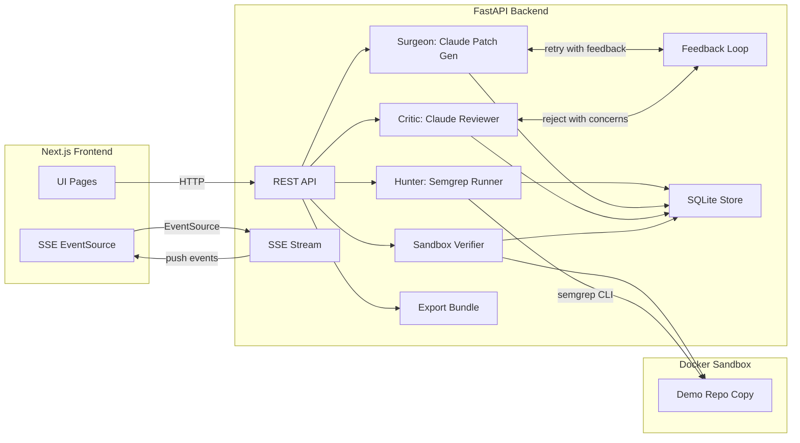
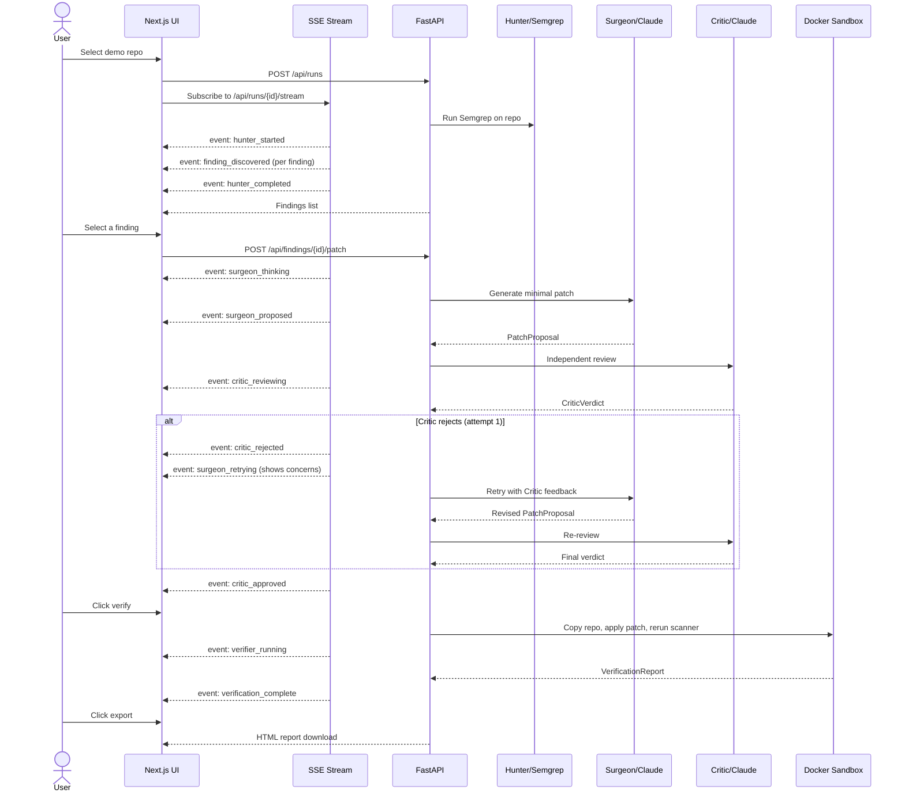

# Vigil MVP Implementation Plan

> **Stack**: Python (FastAPI) backend + Next.js frontend + Semgrep scanner + Claude (Anthropic) for LLM agents
> **Demo target**: Professor demo of a multi-agent DevSecOps gatekeeper for vibe-coded repos

## What Makes This Special

Five features that elevate this beyond a standard security tool:

1. **Surgeon-Critic feedback loop** — on rejection, Surgeon retries once with Critic's objections. Real multi-agent interaction, not just sequential calls.
2. **SSE streaming** — agent steps stream to the UI in real time. The demo is watchable, not just clickable.
3. **Vibe-coded Express demo repo** — looks like something a student actually asked ChatGPT to build, not a textbook exercise.
4. **Agent personas in UI** — Hunter/Surgeon/Critic are visually distinct with the trace timeline as the primary navigation element.
5. **HTML export report** — a self-contained `.html` file you can open in a browser, not just a ZIP of JSON.

---

## Architecture Overview



## MVP User Flow (with streaming + feedback loop)



---

## Directory Structure

```
vigil-ai/
├── backend/
│   ├── app/
│   │   ├── main.py                  # FastAPI app, CORS, lifespan
│   │   ├── config.py                # Settings (Anthropic key, paths, DB)
│   │   ├── db.py                    # SQLite setup (aiosqlite)
│   │   ├── models/                  # Pydantic schemas (contracts)
│   │   │   ├── finding.py           # Finding
│   │   │   ├── patch.py             # PatchProposal (+ attempt number)
│   │   │   ├── critic.py            # CriticVerdict
│   │   │   ├── verification.py      # VerificationReport
│   │   │   └── trace.py             # TraceEvent
│   │   ├── scanner/                 # Hunter module
│   │   │   ├── runner.py            # Invoke semgrep CLI, collect JSON
│   │   │   └── normalizer.py        # Semgrep JSON -> Finding[]
│   │   ├── agents/                  # LLM-backed agents
│   │   │   ├── surgeon.py           # Claude: finding -> diff (supports retry)
│   │   │   ├── critic.py            # Claude: diff -> verdict
│   │   │   └── orchestrator.py      # Surgeon-Critic feedback loop
│   │   ├── verification/            # Sandbox pipeline
│   │   │   └── sandbox.py           # Copy repo, apply patch, rerun
│   │   ├── export/                  # Bundle builder
│   │   │   ├── bundle.py            # ZIP + HTML report generation
│   │   │   └── report_template.html # Jinja2 template for HTML report
│   │   ├── store/                   # Persistence helpers
│   │   │   └── trace_store.py       # CRUD for trace events
│   │   ├── streaming/               # SSE infrastructure
│   │   │   └── sse.py               # Event bus + SSE endpoint helpers
│   │   └── routes/                  # API routes
│   │       ├── repos.py             # GET /api/repos
│   │       ├── runs.py              # POST /api/runs, GET /api/runs/{id}
│   │       ├── findings.py          # GET .../findings, POST .../patch
│   │       ├── patches.py           # POST .../review, POST .../verify
│   │       ├── stream.py            # GET /api/runs/{id}/stream (SSE)
│   │       └── export.py            # GET .../export
│   ├── requirements.txt
│   └── Dockerfile
├── frontend/
│   ├── src/
│   │   ├── app/
│   │   │   ├── page.tsx             # Repo selection
│   │   │   ├── layout.tsx           # Shell layout, nav, dark mode
│   │   │   └── runs/
│   │   │       └── [runId]/
│   │   │           ├── page.tsx     # Findings dashboard
│   │   │           └── findings/
│   │   │               └── [findingId]/
│   │   │                   └── page.tsx  # Detail + patch + critic + verify
│   │   ├── components/
│   │   │   ├── RepoCard.tsx
│   │   │   ├── FindingsTable.tsx
│   │   │   ├── CodeSnippet.tsx
│   │   │   ├── DiffViewer.tsx
│   │   │   ├── AgentCard.tsx        # Reusable agent persona card
│   │   │   ├── CriticVerdict.tsx
│   │   │   ├── VerificationResult.tsx
│   │   │   ├── TraceTimeline.tsx    # Primary navigation element
│   │   │   ├── LiveFeed.tsx         # SSE-powered activity stream
│   │   │   └── ExportButton.tsx
│   │   ├── hooks/
│   │   │   └── useRunStream.ts      # EventSource hook for SSE
│   │   └── lib/
│   │       └── api.ts               # Typed fetch wrapper
│   ├── package.json
│   ├── tailwind.config.ts
│   └── Dockerfile
├── demo-repos/
│   └── vibe-todo-app/               # "Vibe-coded" Express.js todo app
│       ├── server.js                # Express app with AI-generated patterns
│       ├── package.json
│       ├── Dockerfile
│       └── README.md                # "Built with ChatGPT" narrative
├── docker-compose.yml               # Backend + frontend + demo-repo
└── AGENTS.md
```

---

## Build Phases

### Phase 1: Contracts and Data Models

Define all typed schemas so every downstream module agrees on shape.

| File | What it defines |
|---|---|
| `backend/app/models/finding.py` | `Finding`: id, run_id, scanner, rule_id, severity, message, file_path, start/end line, snippet, metadata, created_at |
| `backend/app/models/patch.py` | `PatchProposal`: id, finding_id, diff, explanation, model_used, attempt (1 or 2), prior_concerns, created_at |
| `backend/app/models/critic.py` | `CriticVerdict`: id, patch_id, approved, reasoning, concerns[], model_used, created_at |
| `backend/app/models/verification.py` | `VerificationReport`: id, patch_id, scanner_rerun_clean, tests_passed, details, created_at |
| `backend/app/models/trace.py` | `TraceEvent`: id, run_id, role, action (enum), payload, timestamp |
| `backend/app/db.py` | SQLite via aiosqlite. Tables: runs, findings, patches, verdicts, verifications, trace_events. Async CRUD helpers. |

### Phase 2: Scanner Runner + Findings Normalization (Hunter)

| File | What it does |
|---|---|
| `backend/app/scanner/runner.py` | `run_semgrep(repo_path) -> dict` — shells out to semgrep CLI, returns raw JSON. Emits trace events. |
| `backend/app/scanner/normalizer.py` | `normalize_findings(raw, run_id) -> list[Finding]` — maps Semgrep JSON to Finding schema. Deterministic. |

### Phase 3: Run API + SSE Streaming

| File | What it does |
|---|---|
| `backend/app/streaming/sse.py` | `EventBus` class — in-memory `run_id -> asyncio.Queue`. publish/subscribe pattern. All agents call publish(). |
| `backend/app/routes/repos.py` | `GET /api/repos` — hardcoded curated demo repo list |
| `backend/app/routes/runs.py` | `POST /api/runs` — creates run, launches Hunter as background task. `GET /api/runs/{id}` — run metadata. |
| `backend/app/routes/stream.py` | `GET /api/runs/{id}/stream` — SSE endpoint via StreamingResponse |

### Phase 4: Findings Explorer Backend

| File | What it does |
|---|---|
| `backend/app/routes/findings.py` | `GET /api/runs/{run_id}/findings` — all findings, sortable by severity. `GET /api/findings/{id}` — single finding detail. |

### Phase 5: Patch Proposal Pipeline (Surgeon)

| File | What it does |
|---|---|
| `backend/app/agents/surgeon.py` | `propose_patch(finding, file_content, prior_concerns?) -> PatchProposal`. Calls Claude. Supports retry with Critic feedback. Publishes SSE events. |

### Phase 6: Critic Review + Feedback Loop

| File | What it does |
|---|---|
| `backend/app/agents/critic.py` | `review_patch(finding, patch, file_content) -> CriticVerdict`. Independent Claude call. Publishes SSE events. |
| `backend/app/agents/orchestrator.py` | `run_patch_review_loop(finding, file_content, max_attempts=2)`. Surgeon proposes -> Critic reviews -> retry if rejected -> return final result. |
| `backend/app/routes/findings.py` | `POST /api/findings/{id}/patch` — launches orchestrator, streams via SSE |

### Phase 7: Verification Pipeline

| File | What it does |
|---|---|
| `backend/app/verification/sandbox.py` | `verify_patch(patch, repo_path) -> VerificationReport`. Copies repo to temp dir, applies diff, reruns Semgrep, checks result. |
| `backend/app/routes/patches.py` | `POST /api/patches/{id}/verify` — only if critic approved. Runs sandbox. |

### Phase 8: Export Bundle (HTML Report)

| File | What it does |
|---|---|
| `backend/app/export/report_template.html` | Jinja2 template — self-contained HTML with embedded CSS, syntax-highlighted diffs, trace timeline. No external deps. |
| `backend/app/export/bundle.py` | `generate_html_report(run_id)` and `generate_zip_bundle(run_id)` |
| `backend/app/routes/export.py` | `GET /api/runs/{id}/export?format=html|zip` |

### Phase 9: UI (Next.js + Tailwind)

**Agent Personas** (consistent across all UI):
- **Hunter** — teal/cyan, radar icon
- **Surgeon** — amber/orange, scalpel icon
- **Critic** — purple/violet, shield icon
- **Verifier** — green, checkmark icon

**Pages**:
- `/` — Repo selection cards
- `/runs/[runId]` — Two-column: TraceTimeline (left) + FindingsTable (right), SSE-powered live updates
- `/runs/[runId]/findings/[findingId]` — Three-panel: timeline (left) + step-by-step flow (center) + live feed (right)

**Key Components**: TraceTimeline, LiveFeed, AgentCard, DiffViewer, CodeSnippet, CriticVerdict, VerificationResult

### Phase 10: Demo Repo + Docker

**Vibe-coded Express.js todo app** (~120 lines) with intentional AI-generated vulnerabilities:
- SQL injection, hardcoded JWT secret, eval(), permissive CORS, path traversal, missing rate limiting
- AI-style comments like `// Simple query to get user's todos`
- README: "Built quickly with AI assistance for the CS 101 final project"

**Docker Compose**: backend (port 8000) + frontend (port 3000) + demo-repo volume

---

## Key Technical Decisions

| Decision | Rationale |
|---|---|
| SQLite | Zero infra, built-in Python, sufficient for demo |
| Anthropic SDK | Claude for Surgeon + Critic agents |
| Semgrep CLI via subprocess | Deterministic scanning, no LLM in scan path |
| Separate system prompts | Surgeon and Critic are independent |
| asyncio.Queue for SSE | Simple event bus, no Redis needed |
| Jinja2 for HTML report | Already a FastAPI dependency |
| Max 2 attempts in feedback loop | Bounded, predictable demo timing |

## Dependencies

**Backend**: fastapi, uvicorn[standard], anthropic, aiosqlite, pydantic, pydantic-settings, jinja2, python-multipart

**Frontend**: next, react, react-dom, tailwindcss, react-diff-viewer-continued, prismjs, lucide-react

**System**: semgrep, Docker, Docker Compose
